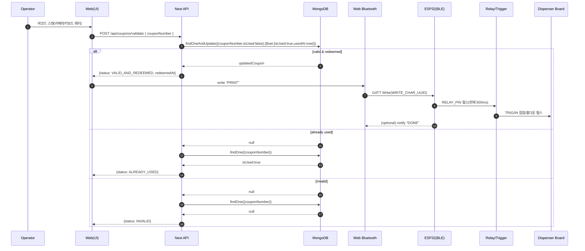

# Photo Card Kiosk — HW/SW End-to-End Overview

이 문서는 `photo-card-app`의 **현재 코드/펌웨어 기준**으로 소프트웨어 흐름과 하드웨어 흐름을 한 번에 정리한 “정답 문서”다.  
하드웨어 배선 상세는 `docs/HARDWARE_WIRING_GUIDE.md`를 기준으로 하고, 여기서는 **시스템 전체 흐름/인터페이스/검증 포인트**를 중심으로 다룬다.

## 1) 시스템 요약

쿠폰 바코드를 스캔하면 Next.js가 `/api/coupons/validate`에서 **쿠폰을 원자적으로 사용 처리**한다.  
검증이 성공(`VALID_AND_REDEEMED`)이면 Web Bluetooth로 ESP32에 `PRINT`를 쓰고, ESP32는 릴레이(또는 버튼 대체 회로)를 짧게 트리거해서 카드배출기 보드의 `TRIG/IN`을 펄스로 동작시킨다.

## 2) “정답의 소스” (변경 시 같이 맞춰야 하는 파일)

- BLE UUID/명령: `src/shared/lib/constants.ts`
- ESP32 펌웨어: `esp32/photo_card_trigger.ino`
- 쿠폰 검증/사용 처리 API: `src/app/api/coupons/validate/route.ts`
- MongoDB 연결: `src/shared/lib/mongodb.ts`
- 쿠폰 모델(Mongoose): `src/entities/coupon/model/coupon.ts`
- 키오스크 화면 오케스트레이션: `src/app/page.tsx`
- 스캔(카메라): `src/features/coupon-scan/ui/CameraTab.tsx`
- 스캔(USB 바코드리더/키보드 웨지): `src/features/coupon-scan/hooks/useBarcodeScanner.ts` (현재 `page.tsx`에서는 미사용)
- BLE 연결/명령 전송(Web Bluetooth): `src/features/ble-connection/hooks/useBLE.ts`

## 3) 구성 요소(논리 아키텍처)

- Browser (Chrome/Edge 권장)
  - Camera/Keyboard input(스캔)
  - Web Bluetooth API(ESP32 연결/명령)
- Next.js(App Router)
  - UI: `src/app/page.tsx`
  - API(Route Handler): `src/app/api/coupons/validate/route.ts`
- MongoDB + Mongoose
  - 쿠폰 컬렉션(유니크 키: `couponNumber`)
- ESP32(BLE GATT Server)
  - `PRINT` 수신 → 릴레이/트리거 핀 펄스 출력
- 카드배출기 보드
  - 외부 `TRIG/IN` 입력을 펄스로 받아 배출 동작

## 4) End-to-End 시퀀스(현재 동작 기준)

## 5) 소프트웨어 흐름(상세)

### 5-1) 스캔 입력

1) 카메라 스캔(현재 메인 화면 사용)
- `src/features/coupon-scan/ui/CameraTab.tsx`
  - `@zxing/browser`로 카메라 스트림을 읽고 바코드 결과를 `onScan(code)`로 전달한다.
  - 중복 스캔 방지를 위해 마지막 코드/시간을 저장하고 **2초 쿨다운**으로 같은 결과 반복 호출을 줄인다.

2) USB 바코드 리더(키보드 웨지) 스캔(구현은 존재, 화면 미사용)
- `src/features/coupon-scan/hooks/useBarcodeScanner.ts`
  - 키 입력 간격(`BARCODE_INPUT_TIMEOUT_MS`)을 이용해 “사람 타이핑”과 “스캐너 입력”을 구분한다.
  - `Enter`/`Tab`을 스캔 종료(suffix)로 보고 버퍼를 쿠폰 번호로 확정한다.
  - 최소 길이는 `BARCODE_MIN_LENGTH`로 제한한다.

### 5-2) 쿠폰 검증 API

- 엔드포인트: `POST /api/coupons/validate`
- 구현: `src/app/api/coupons/validate/route.ts`
- 동시성 핵심:
  - 조건: `{ couponNumber: normalizedCode, isUsed: false }`
  - 갱신: `{ $set: { isUsed: true, usedAt: new Date() } }`
  - 결과: 동일 쿠폰이 동시에 들어와도 **첫 요청만 성공**하고 이후는 `ALREADY_USED`로 떨어지도록 설계됨

응답 상태:
- `VALID_AND_REDEEMED`: 유효하며 사용 처리 완료
- `ALREADY_USED`: 이미 사용됨
- `INVALID`: 존재하지 않거나 요청 형식 오류(빈 값/타입 오류 포함)

### 5-3) BLE 전송(Web Bluetooth)

- 훅: `src/features/ble-connection/hooks/useBLE.ts`
  - `navigator.bluetooth.requestDevice({ filters: [{ services: [BLE_SERVICE_UUID] }] })`로 기기 선택
  - GATT 연결 → Service → Write Characteristic 획득 후 `PRINT`를 write
  - 현재 웹은 `DONE` notify를 구독하지 않는다(즉, write 성공 여부로만 트리거 성공/실패를 판단)

## 6) BLE 프로토콜(웹 ↔ ESP32)

정의 파일: `src/shared/lib/constants.ts` / `esp32/photo_card_trigger.ino`

| 항목 | 값 |
|---|---|
| Service UUID | `12345678-1234-1234-1234-1234567890a1` |
| Write Char UUID | `12345678-1234-1234-1234-1234567890a2` |
| Notify Char UUID | `12345678-1234-1234-1234-1234567890a3` |
| Web → ESP32 | `PRINT` |
| ESP32 → Web(옵션) | `DONE` |

## 7) ESP32 펌웨어 동작(요약)

파일: `esp32/photo_card_trigger.ino`

- BLE GATT Server로 동작하며 디바이스 이름은 `PhotoCard-ESP32`다.
- Write Characteristic에 `PRINT` 문자열이 들어오면 `triggerOutput()`를 호출한다.
- 출력 트리거:
  - `RELAY_PIN = 4`를 `HIGH`로 올리고 `TRIGGER_DURATION_MS = 500`ms 후 `LOW`로 내린다.
  - 동시에 `LED_PIN = 2`도 같이 토글한다(테스트 확인용).
- 옵션 동작:
  - Notify Characteristic을 통해 `DONE`을 notify 한다(웹은 현재 미사용).

주의:
- 릴레이 모듈이 `LOW=ON(Active-Low)` 타입이고 `IN`을 GPIO에 직접 물리는 구성이라면, 펌웨어에서 ON/OFF 로직 반전이 필요할 수 있다. (권장 결선은 `docs/HARDWARE_WIRING_GUIDE.md`의 NPN/옵토 기반)
- `GPIO4`는 보드/모듈에 따라 부팅 스트랩 영향이 생길 수 있으니, 외부 회로가 부팅 시 GPIO 레벨을 강하게 당기지 않도록 설계한다.

## 8) 하드웨어 흐름(요약)

웹에서 “출력”이란 결국 하드웨어적으로는 **카드배출기 보드 `TRIG/IN`에 버튼 입력과 동등한 펄스(접점 쇼트 또는 GND 풀다운)를 만드는 것**이다.

권장 회로/결선 가이드:
- 상세: `docs/HARDWARE_WIRING_GUIDE.md`
- 핵심 원칙:
  - `TRIG/IN` 스펙이 확정되지 않았으면 ESP32 GPIO 직결 금지
  - 불확실할수록 “당기기(오픈컬렉터)” 또는 “절연(옵토)” 방식이 안전
  - `OUT/SEN`이 3.3V 초과면 반드시 레벨 변환/절연 후 ESP32로 입력

## 9) 런타임/현장 전제(중요)

- Web Bluetooth는 **HTTPS 또는 localhost**에서만 동작한다.
  - 로컬 네트워크에서 태블릿 등으로 접속해 테스트할 때는 `npm run dev:https`를 사용한다.
- 카메라 스캔은 브라우저 권한이 필요하다.
- 권장 브라우저: Chrome/Edge 계열 (Safari/Firefox는 Web Bluetooth 미지원)

## 10) 1회 설치/검증 체크리스트(현장)

1) DB
- `MONGODB_URI` 설정 확인
- `npm run seed`로 테스트 쿠폰 데이터 삽입(운영 DB에서 실행 금지)

2) 웹/스캔
- 카메라 권한 확인(후면 카메라 인식 확인)
- (USB 리더 사용 시) 키보드 웨지 입력이 `Enter`/`Tab` suffix를 보내는지 확인

3) BLE
- HTTPS 또는 localhost에서 접속 중인지 확인
- BLE 연결 버튼으로 `PhotoCard-ESP32` 선택 후 연결 상태 확인

4) 하드웨어
- `PRINT` 수신 시 릴레이 동작(딸깍/LED) 확인
- 카드배출기 보드 `TRIG/IN`에 펄스가 들어가는지 멀티미터/테스트로 확인
